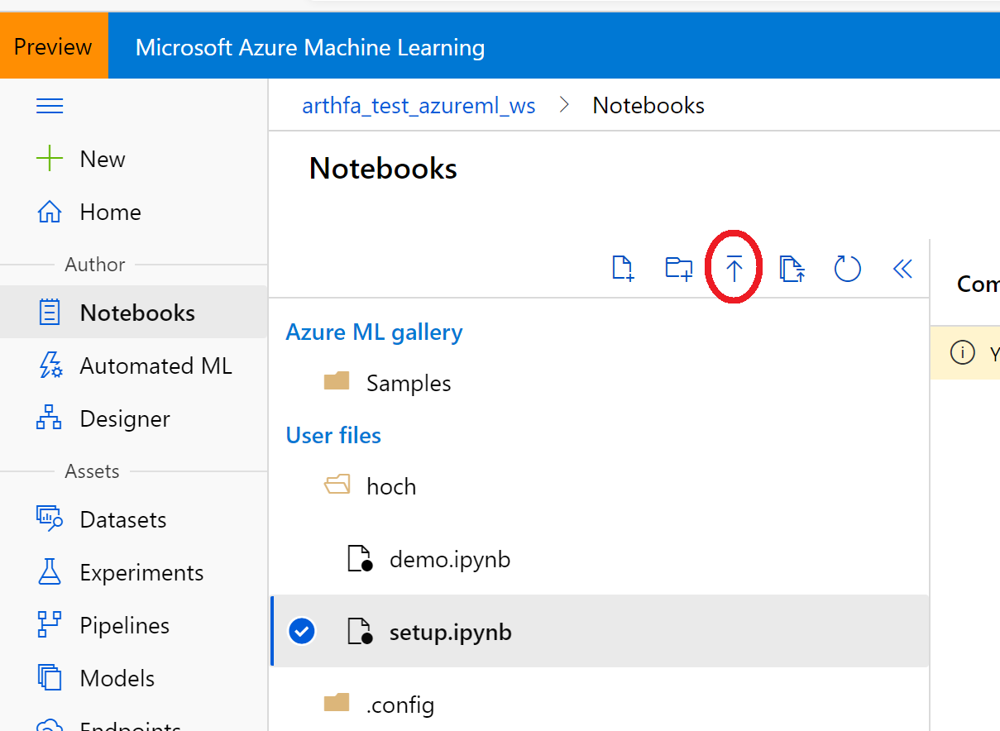
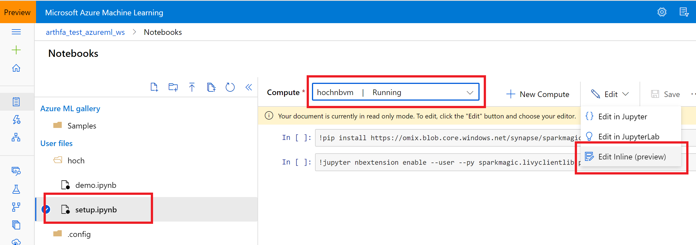
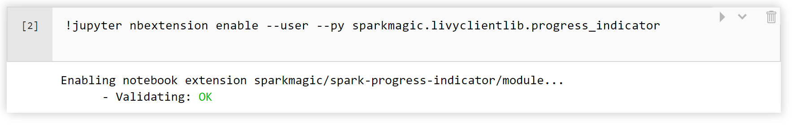
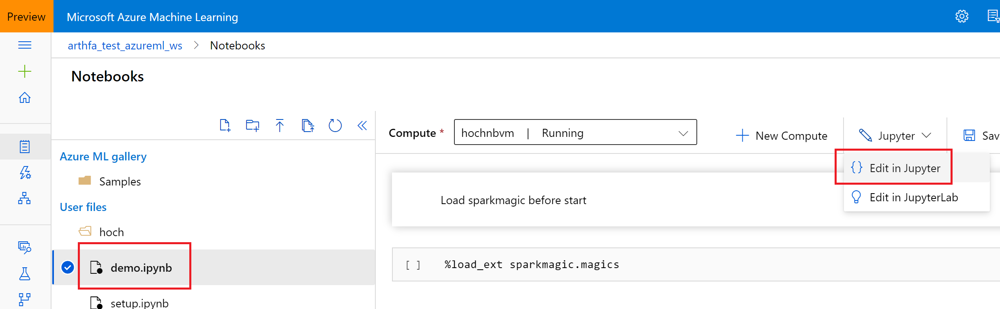
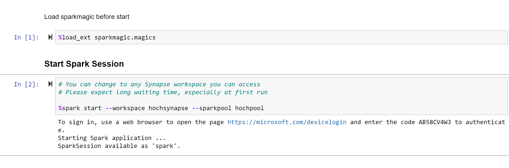
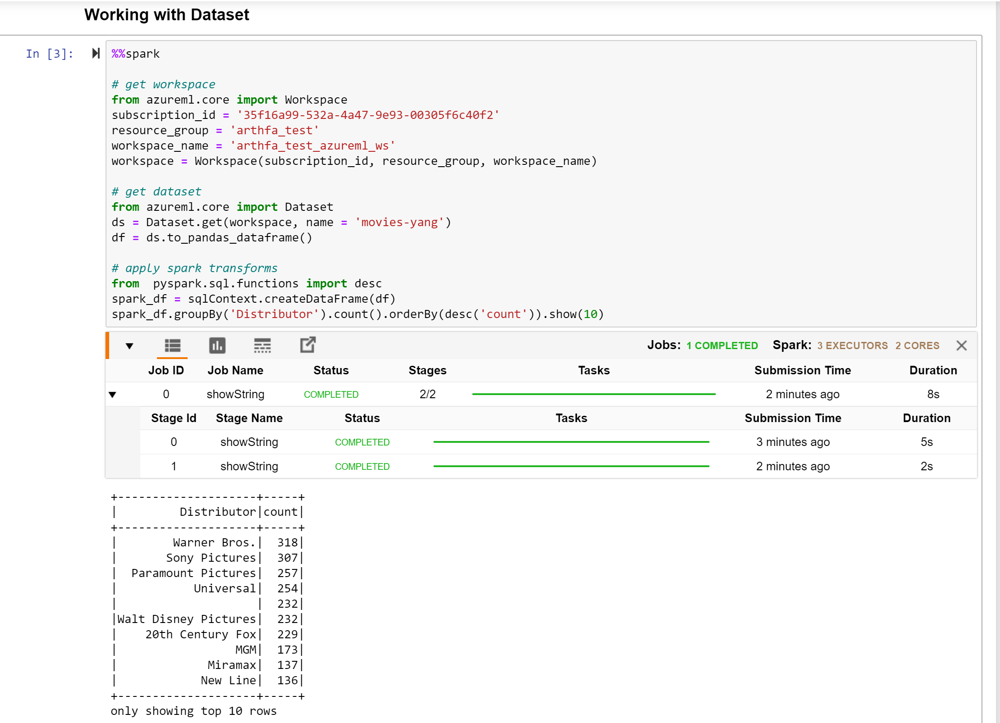
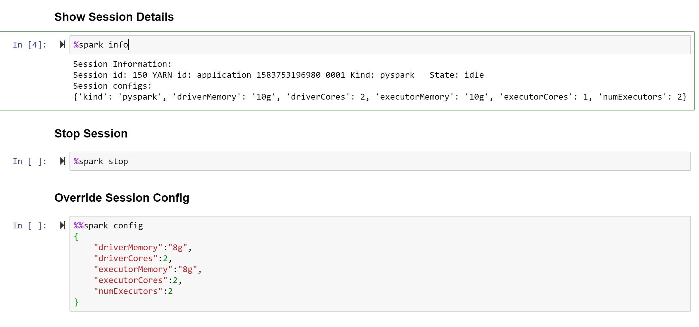

# Notebook Experience with SparkMagic

You can find the demo video at:

https://web.microsoftstream.com/video/d1a5f28c-2d23-4bfe-ba0e-3729bf2a14f4

## Feature List
1. Start Spark session against Synapse
2. Run PySpark code
3. Show Spark progress
4. Get session details
5. Set session config
6. Stop session

## Try it by yourself

1. Copy [setup.ipynb](setup.ipynb) and [demo.ipynb](demo.ipynb) to your workspace.

* Open your AML Workspac -> select Notebook -> Click Upload button -> Select your folder -> upload the two notebook files.

2. Start AML notebook and run setup.ipynb to install.

* Select setup.ipynb -> select your NBVM -> click "Edit inline" -> Run the two statements
* If no error, it will show validating ok.

3. Run demo.ipynb.

* Select demo.ipynb -> click "Edit in Jupyter"

* Don't forget run first load_ext.
* It will ask you sign. 
* Start a spark session may cost several minutes.

* Submit code by '%%spark'.
* You can see the progress indicator when it is running. Currently it dose not work in AZNB.

* You can try other '%spark' magic.
* At the end of demo.ipynb, there are two code examples.
* Before submit code, make sure there is a activate session running.
